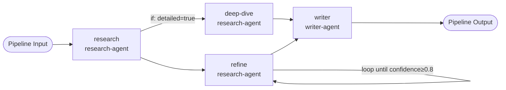

# ArkFlow

**API:** `arkonis.dev/v1alpha1`
**Kind:** `ArkFlow`
**Short name:** none

A novel resource with no Kubernetes equivalent. Defines a directed acyclic graph (DAG) of agents where the output of one step feeds into the input of the next. The primitive for declarative multi-agent workflows.

## Example

```yaml
apiVersion: arkonis.dev/v1alpha1
kind: ArkFlow
metadata:
  name: research-write-review
  namespace: default
spec:
  timeoutSeconds: 600
  input:
    topic: "AI in healthcare"
    detailed: "true"
  steps:
    - name: research
      arkonisDeployment: research-agent
      inputs:
        prompt: "Research: {{ .pipeline.input.topic }}"
      outputSchema: |
        {"type":"object","properties":{"summary":{"type":"string"},"confidence":{"type":"number"}},"required":["summary","confidence"]}

    - name: deep-dive
      arkonisDeployment: research-agent
      dependsOn: [research]
      if: "{{ eq .pipeline.input.detailed \"true\" }}"
      inputs:
        prompt: "Expand on: {{ .steps.research.data.summary }}"

    - name: refine
      arkonisDeployment: research-agent
      dependsOn: [research]
      inputs:
        prompt: "Improve this summary: {{ .steps.research.data.summary }}"
      outputSchema: |
        {"type":"object","properties":{"summary":{"type":"string"},"confidence":{"type":"number"}},"required":["summary","confidence"]}
      loop:
        condition: "{{ lt (index .steps.refine.data \"confidence\") 0.8 }}"
        maxIterations: 3

    - name: writer
      arkonisDeployment: writer-agent
      dependsOn: [deep-dive, refine]
      inputs:
        research: "{{ .steps.refine.data.summary }}"

  output: "{{ .steps.writer.output }}"
```

## Pipeline DAG



## Spec fields

### Top-level

| Field | Type | Required | Description |
|---|---|---|---|
| `input` | map[string]string | no | Named input values for the pipeline. Referenced in step inputs via `{{ .pipeline.input.<key> }}`. |
| `steps` | []PipelineStep | yes | Ordered list of pipeline steps. The controller validates that `dependsOn` references are resolvable and form a valid DAG (no cycles). |
| `output` | string | no | Template expression selecting which step output to return as the pipeline result. |
| `timeoutSeconds` | int | no | Maximum wall-clock seconds the pipeline may run before being failed with reason `TimedOut`. Zero means no timeout. |

### `steps[]`

| Field | Type | Required | Description |
|---|---|---|---|
| `name` | string | yes | Unique step name within the pipeline. Referenced in template expressions as `{{ .steps.<name>.output }}`. |
| `arkonisDeployment` | string | yes | Name of the `ArkAgent` in the same namespace that will execute this step. |
| `dependsOn` | []string | no | List of step names that must complete (Succeeded or Skipped) before this step runs. |
| `inputs` | map[string]string | no | Key-value inputs passed to the agent for this step. Values are template expressions or literal strings. |
| `outputSchema` | string | no | JSON Schema (as a string) describing the expected output shape. The agent is instructed to respond in this format and the output is validated before the step is marked Succeeded. Downstream steps can reference fields via `{{ .steps.<name>.data.<field> }}`. |
| `if` | string | no | Go template expression. When set, the step only runs if this evaluates to a truthy value. A falsy result marks the step **Skipped**, which satisfies downstream dependency checks. |
| `loop` | LoopSpec | no | Repeat this step until the loop condition becomes false or `maxIterations` is reached. |

### `loop`

| Field | Type | Default | Description |
|---|---|---|---|
| `condition` | string | — | Go template expression evaluated after each iteration. The step repeats while this is truthy. Example: `"{{ lt (index .steps.refine.data \"confidence\") 0.8 }}"` |
| `maxIterations` | int | `10` | Hard cap on loop repetitions to prevent infinite loops. Must be between 1 and 100. |

## Template syntax

Step inputs, `if` conditions, loop `condition`, and the pipeline `output` field all use Go template syntax:

| Expression | Resolves to |
|---|---|
| `{{ .pipeline.input.<key> }}` | A named value from `spec.input`. |
| `{{ .steps.<name>.output }}` | The complete raw output string from a completed step. |
| `{{ .steps.<name>.data.<field> }}` | A specific field from a step's JSON output (requires `outputSchema` on that step). |

Templates are evaluated at runtime. Missing keys resolve to an empty string.

## Step phases

| Phase | Meaning |
|---|---|
| `Pending` | Waiting for dependencies or not yet submitted. |
| `Running` | Task submitted to the agent queue; awaiting result. |
| `Succeeded` | Agent returned a result (validated against `outputSchema` if set). |
| `Failed` | Agent returned an error or output failed schema validation. |
| `Skipped` | The `if` condition evaluated to false; treated as done for dependency purposes. |

## Status fields

| Field | Type | Description |
|---|---|---|
| `phase` | string | `Pending`, `Running`, `Succeeded`, `Failed`. |
| `steps` | []PipelineStepStatus | Per-step status including phase, task ID, start/completion time, output, and iteration count. |
| `output` | string | Final resolved output value after the pipeline completes. |
| `conditions` | []Condition | Standard Kubernetes conditions. Reason `TimedOut` when `timeoutSeconds` is exceeded. |

## Alpha limitations

{: .warning }
ArkFlow is in early alpha. The following limitations apply:

- Parallel step execution (steps with no shared `dependsOn` ancestor) is not yet implemented. Steps run in dependency order.
- Pipeline inputs are currently limited to string values.
- Requires Redis — `TASK_QUEUE_URL` must be set in the `ark-operator-api-keys` secret.
