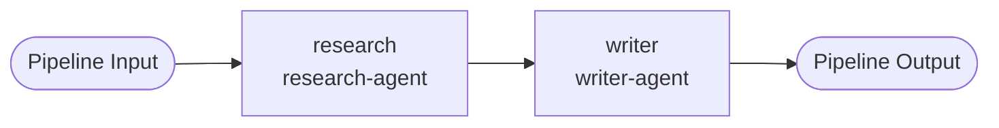

# ArkonisPipeline

**API:** `arkonis.dev/v1alpha1`
**Kind:** `ArkonisPipeline`
**Short name:** `aopipe`

A novel resource with no Kubernetes equivalent. Defines a directed acyclic graph (DAG) of agents where the output of one step feeds into the input of the next. The primitive for declarative multi-agent workflows.

## Example

```yaml
apiVersion: arkonis.dev/v1alpha1
kind: ArkonisPipeline
metadata:
  name: research-write-review
  namespace: default
spec:
  input:
    topic: "AI in healthcare"
  steps:
    - name: research
      arkonisDeployment: research-agent
      inputs:
        topic: "{{ .pipeline.input.topic }}"
    - name: writer
      arkonisDeployment: writer-agent
      dependsOn: [research]
      inputs:
        research: "{{ .steps.research.output }}"
  output: "{{ .steps.writer.output }}"
```

## Pipeline DAG



## Spec fields

### Top-level

| Field | Type | Required | Description |
|---|---|---|---|
| `input` | map[string]string | no | Named input values for the pipeline. Referenced in step inputs via `{{ .pipeline.input.<key> }}`. |
| `steps` | []PipelineStep | yes | Ordered list of pipeline steps. The controller validates that `dependsOn` references are resolvable and form a valid DAG (no cycles). |
| `output` | string | no | Template expression selecting which step output to return as the pipeline result. |

### `steps[]`

| Field | Type | Required | Description |
|---|---|---|---|
| `name` | string | yes | Unique step name within the pipeline. Referenced in template expressions as `{{ .steps.<name>.output }}`. |
| `arkonisDeployment` | string | yes | Name of the `ArkonisDeployment` in the same namespace that will execute this step. |
| `dependsOn` | []string | no | List of step names that must complete before this step runs. Omit for steps with no dependencies (they run immediately). |
| `inputs` | map[string]string | no | Key-value inputs passed to the agent for this step. Values are template expressions or literal strings. |

## Template syntax

Step inputs and the pipeline `output` field use Go template syntax:

| Expression | Resolves to |
|---|---|
| `{{ .pipeline.input.<key> }}` | A named value from `spec.input`. |
| `{{ .steps.<name>.output }}` | The complete output string from a completed step. |

Templates are evaluated at runtime by the pipeline controller when each step is dispatched. Forward references (referencing a step that has not yet run) are not permitted and will fail validation.

## Status fields

| Field | Type | Description |
|---|---|---|
| `phase` | string | `Pending`, `Running`, `Succeeded`, `Failed`. |
| `steps` | []PipelineStepStatus | Per-step status including phase, task ID, start time, completion time, and output. |
| `output` | string | Final resolved output value after the pipeline completes. |
| `conditions` | []Condition | Standard Kubernetes conditions. |

## Alpha limitations

{: .warning }
ArkonisPipeline is in early alpha. The following limitations apply in v0.0.1:

- Parallel step execution (steps with no shared `dependsOn` ancestor) is not yet implemented. Steps run in dependency order, one at a time.
- There is no retry policy for failed steps.
- Pipeline inputs are currently limited to string values.
- Requires Redis — `TASK_QUEUE_URL` must be set in the `arkonis-operator-api-keys` secret.
